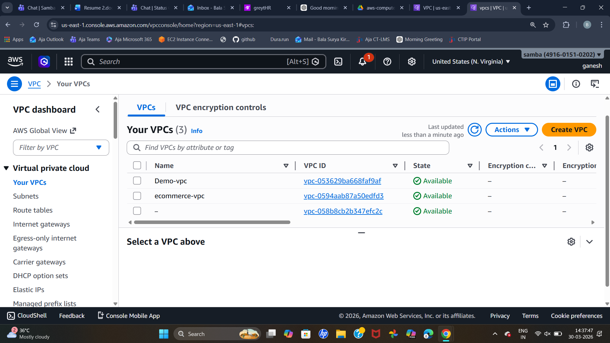
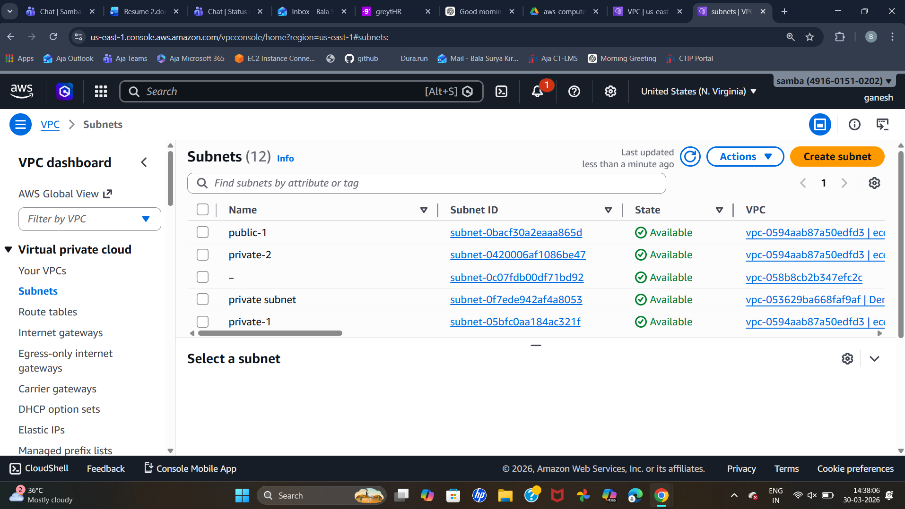
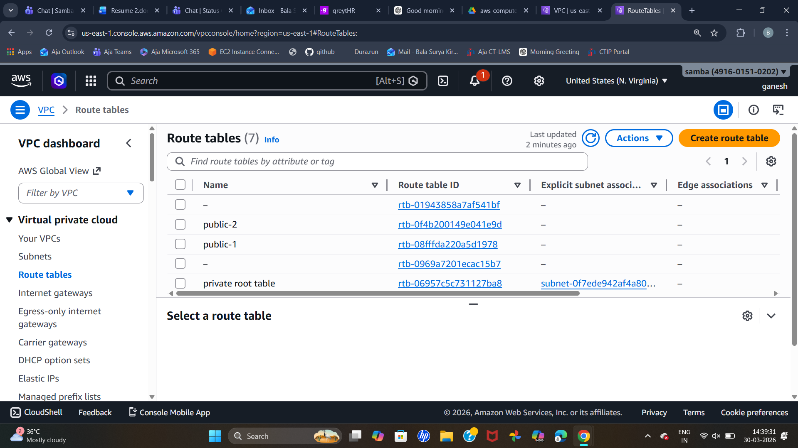
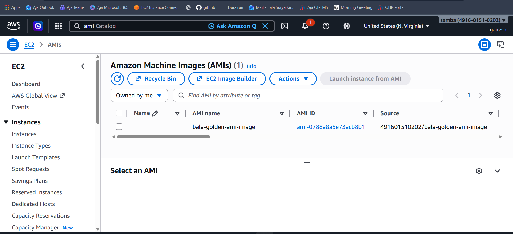
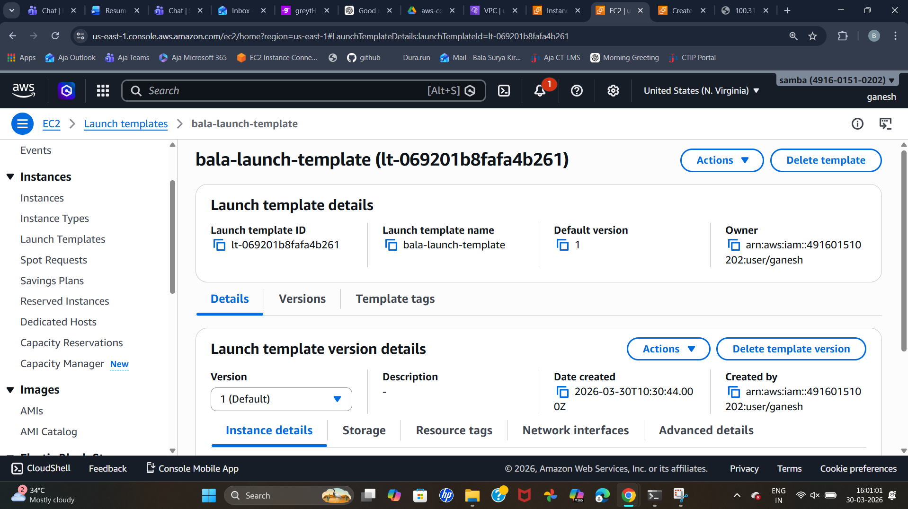

Highly Available 3-Tier Web Application on AWS
________________________________________
 Project Overview
This project demonstrates the deployment of a highly available, scalable, and secure 3-tier web application on AWS.
The architecture is designed to:
•	Handle traffic spikes (auto scaling) 
•	Ensure high availability (multi-AZ) 
•	Provide secure access (HTTPS) 
•	Separate concerns using 3-tier design 
________________________________________
Objectives
•	Deploy infrastructure across multiple Availability Zones 
•	Configure Auto Scaling Group (ASG) 
•	Use Application Load Balancer (ALB) for traffic distribution 
•	Store static content in S3 
•	Secure application using HTTPS 
•	Implement secure access using Bastion Host 
•	Enable EBS encryption using KMS 

Architecture Diagram (Explain in words)
Flow:
User → ALB (HTTPS) → Target Group → EC2 (ASG in Private Subnets)
                                     ↓
                                   EBS
                                     ↓
                                    S3
                 → Access Private EC2

Infrastructure Setup
VPC Configuration
•	Created VPC with CIDR: 10.0.0.0/16 

 
 

Subnets
•	Public Subnets: 
o	10.0.1.0/24 (AZ-1a) 
o	10.0.2.0/24 (AZ-1b) 
•	Private Subnets: 
o	10.0.3.0/24 (AZ-1a) 
o	10.0.4.0/24 (AZ-1b) 
•	 
 

Route Tables
•	Public Route Table (RT-1) 
o	Route: 0.0.0.0/0 → Internet Gateway 
o	Associated with Public Subnets 
•	Private Route Table (RT-2) 
o	Route: 0.0.0.0/0 → NAT Gateway 
o	Associated with Private Subnets 
•	 
 
 

 Internet & NAT Setup
•	Internet Gateway attached to VPC 
•	NAT Gateway created in Public Subnet 

 Golden AMI
•	Installed Apache/Nginx 
•	Deployed application code 
•	Created reusable AMI for consistency 
•	 
 

 Launch Template
•	Instance Type: t3.micro 
•	AMI: Golden AMI 
•	Security Group attached 
•	Configured User Data for automation 
•	 
•	 
 
 
________________________________________
Storage Layer
 EBS Configuration
•	Volume Type: gp3 
•	Size: 20 GB 
•	Encryption enabled using AWS Key Management Service 
 
 S3 Configuration
Used Amazon S3 for:
•	Static files (images, CSS, JS) 
Features:
•	Versioning enabled 
•	Highly durable storage 

________________________________________
 Target Group
•	Protocol: HTTP 
•	Port: 80 
•	Health checks enabled 
 

 Load Balancer Layer
 Application Load Balancer (ALB)
•	Type: Internet-facing 
•	Deployed in Public Subnets 
 
Auto Scaling Group (ASG)
•	Min: 2 | Desired: 2 | Max: 4 
•	Deployed in Private Subnets across 2 AZs 
Scaling Policy:
•	Target tracking based on CPU utilization (70%) 
Features:
•	Self-healing (replaces unhealthy instances) 
•	High availability 
•	 

HTTPS Configuration
Used AWS Certificate Manager
•	Listener: HTTPS (443) 
•	SSL certificate attached 
Advanced Features
•	Cross-Zone Load Balancing enabled 
•	Sticky Sessions enabled (1 hour) 
Security Configuration
Security Groups
ALB SG
•	Allow HTTPS (443) from Internet 
App Server SG
•	Allow HTTP only from ALB SG 
Bastion SG
•	Allow SSH (22) only from My IP 
 
Access Flow
User → ALB → EC2 (Private)
Admin → Bastion → EC2
________________________________________
Validation & Testing
•	Accessed application via ALB DNS 
                     
 
•	Verified load balancing across instances 
•	Tested auto scaling using load 
•	Terminated instance → ASG recreated it 
•	Verified HTTPS access 
 
________________________________________
 Key Concepts Used
•	High Availability (Multi-AZ) 
•	Auto Scaling 
•	Load Balancing 
•	Secure Access (Bastion Host) 
•	Data Encryption (EBS + KMS) 
•	Object Storage (S3) 
•	HTTPS Security 
________________________________________
Challenges Faced
(You can customize this section)
Example:
•	Incorrect route table association 
•	Security group misconfiguration 
•	Target group health check failures 
________________________________________
Conclusion
The project successfully demonstrates a scalable, secure, and highly available AWS architecture capable of handling production-level workloads.
It follows best practices like:
•	Multi-AZ deployment 
•	Auto scaling 
•	Secure networking 
•	Encrypted storage 

